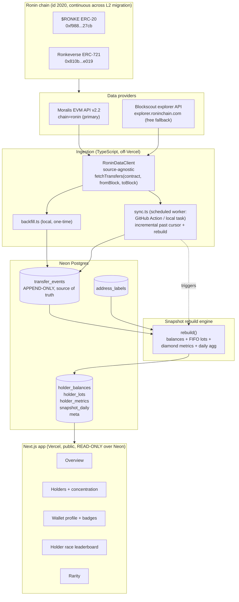
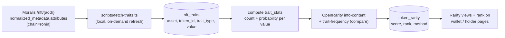

# feat: Ronke Analytics Dashboard

A public-facing holder-analytics dashboard for the **$RONKE** ERC-20 token and the **Ronkeverse** ERC-721 NFT collection on Ronin. It ingests full transfer history into an append-only local/hosted database, rebuilds derived holder snapshots on a schedule, and surfaces holder distribution, concentration (Gini, whale share), diamond-hands stats (holding-duration buckets, percent never sold), and new-vs-exiting holder trends. Inspired by [diamondhands.fly.dev](https://diamondhands.fly.dev/) and [kongzboard.com](https://kongzboard.com/).

**Target repo:** this plan targets a new standalone project, `ronke-analytics`. All file paths below are repo-relative to that project root. It is intentionally separate from `crypto-books`: that app answers "what do *my* wallets hold and what is my tax basis"; this app answers "who holds RONKE/Ronkeverse and how strong are their hands." Same chain, inverse query shape, no shared database.

---

## Summary

Build a Next.js + Neon Postgres + Vercel dashboard (matching the `cre-hub` stack) that:

1. **Ingests once, appends forever.** A one-time backfill pulls the complete transfer/event history for both contracts into an append-only `transfer_events` table. A scheduled incremental sync appends only new events past a per-asset block cursor. Derived holder snapshots are rebuilt after every sync.
2. **Handles the Ronin - OP Stack L2 migration** (May 12 2026, block 55,577,490) via a source-agnostic block-range ingestion layer with an empirical continuity check, so the pre-sidechain and post-L2 eras stitch into one continuous history keyed on `block_number`.
3. **Computes diamond-hands behaviorally**, not by cost basis (RONKE is an unpriced memecoin): FIFO behavioral lots for the token, per-`token_id` holding clocks for the NFT, with transfer-vs-sell classification driven by an address-label table (excludes staking / bridge / game-internal / CEX moves).
4. **Presents** an overview, a holders/concentration view, a per-wallet lookup, and a "holder race" leaderboard, with a token/NFT toggle throughout.
5. **Ranks Ronkeverse by rarity.** Ingests the collection's trait metadata, computes per-token rarity locally with the OpenRarity information-content method (plus a simpler trait-frequency score for comparison), and surfaces trait-distribution charts, a rarity leaderboard, and per-token rarity rank wired into the wallet and holder views.

Data providers: **Moralis** (already integrated in `crypto-books`; free tier 40,000 CU/day is ample for daily refresh) as primary, with the **free Blockscout Ronin explorer API** (`explorer.roninchain.com/api`) as a fallback and cross-check for the expensive full-history replay.

---

## Problem Frame

The user wants community-facing analytics for the Ronke ecosystem on Ronin, in the spirit of NFT holder dashboards. `crypto-books` already talks to Ronin via Moralis but only per-wallet (the user's own wallets), which is the wrong shape for holder analytics: a dashboard needs *all holders of a contract* plus *the full transfer history of that contract* to compute holding duration. Three forces shape the design:

- **Cost control.** Full transfer-history replay is the single most expensive recurring API operation. The free Moralis tier is fine if history is pulled *once* and cached locally, then synced incrementally. Re-pulling full history on every page load would burn the CU budget (the same 401 = "CU budget exhausted" failure mode already documented in `crypto-books`).
- **The L2 migration boundary.** Ronin migrated from a standalone sidechain to an OP Stack L2 on May 12 2026 at block 55,577,490. Chain ID stayed 2020 and the migration was state-continuous, so history *should* be one sequence, but the ingestion design must not assume that silently.
- **No cost basis.** RONKE has no reliable price feed, so "diamond hands" must be defined behaviorally (did previously-held units leave the wallet as a genuine sell) rather than via realized P&L.

**Actors:** anonymous public visitors (view dashboards, look up any wallet); the owner (runs backfill, curates address labels). No login for viewers in v1.

---

## Scope Boundaries

### In scope (v1)
- Two assets: $RONKE (ERC-20, `0xf988f63bf26c3ed3fbf39922149e3e7b1e5c27cb`) and Ronkeverse (ERC-721, `0x810b6d1374ac7ba0e83612e7d49f49a13f1de019`). Addresses to be spot-confirmed on `app.roninchain.com` before hardcoding (see Risks).
- Append-only transfer/event ingestion with one-time backfill + scheduled incremental sync.
- Derived holder snapshots: current holders, balances/holdings, first-acquired, concentration (Gini, top-N share, distribution histogram), diamond-hands buckets and percent-never-sold, daily new/exited holder counts.
- Public dashboard: overview, holders/concentration, per-wallet lookup, holder-race leaderboard, token/NFT toggle.
- Address-label table to exclude non-sell transfers and non-holder addresses (contracts, burn, CEX, staking, bridge, game-internal).
- **Ronkeverse rarity tool:** ingest trait metadata for all tokens, compute per-token rarity (OpenRarity ranking, trait-frequency stored as internal cross-check), and present trait-distribution charts, a rarity leaderboard, a trait-filterable token explorer, and per-token rarity rank surfaced on the wallet and holder views.
- **Wallet badges + profile page:** the wallet page doubles as a profile showing an earned-badge shelf - tiered badges for $RONKE bag size, Ronkeverse holdings count, and holding length, plus derived achievement badges (Diamond Hands, OG/Early, Whale, Rarity Hunter, Dual Citizen, Never Paper-handed, Accumulator). Config-driven, derived from existing snapshots, surfaced on the profile and its shareable OG card.

### Deferred to follow-up work
- Bubble-map / wallet-network graph (a la diamondhands "Bubble Map").
- ENS / web3.bio / Twitter identity resolution on wallets.
- Realized/unrealized USD P&L per wallet (needs a RONKE price history feed and marketplace sale events, not just transfers).
- Alerting / notifications (whale moved, holder milestone).
- Multi-collection support beyond the two Ronke assets.
- Auth / accounts / saved wallets for viewers.
- User-facing rarity method toggle (OpenRarity vs trait-frequency) and multi-trait AND filtering - v1 ships OpenRarity ranking + single-trait filter; trait-frequency stays an internal cross-check.
- Speculative badges beyond the v1 set (e.g. Comeback Kid, trait-set completion) until the core badge shelf is validated.

### Non-goals (belongs elsewhere or out of product identity)
- Cost-basis or tax accounting. That is `crypto-books`; this app deliberately does not compute basis.
- Trading, swaps, or portfolio management.
- Indexing tokens/collections outside the Ronke ecosystem.

---

## Key Technical Decisions

**KTD-1: Standalone Next.js + Neon Postgres + Vercel, public.** Chosen for the public-facing requirement, matching the existing `cre-hub` deployment shape (Next.js + Neon + Vercel). An all-TypeScript stack keeps one language across ingestion worker and frontend and deploys cleanly to Vercel. (Alternative considered: Streamlit like `crypto-books` - rejected because the user confirmed public-facing, and Streamlit is weaker for a shareable community web app.)

**KTD-2: Append-only raw event log as source of truth; snapshots are derived and rebuildable.** `transfer_events` is immutable and unique on `(asset, tx_hash, log_index)`. Everything the dashboard shows is recomputed from it. This makes the diamond-hands logic auditable and lets us change metric definitions without re-pulling chain data. (Directly mirrors the `crypto-books` "raw legs -> Rebuild Lots" split.)

**KTD-3: Rebuild must run after every sync.** Carrying forward the documented `crypto-books` footgun: a nightly sync that appends events but does not rebuild snapshots makes new activity silently vanish from the dashboard. The scheduled sync job (see KTD-7) triggers a snapshot rebuild as its final step, and `meta.last_sync_at` / `meta.last_rebuild_at` are surfaced in the UI so staleness is visible.

**KTD-4: Migration handled by a source-agnostic, block-range ingestion interface with a stitch constant.** `MIGRATION_BLOCK = 55_577_490` is a named constant. The ingestion client exposes `fetchTransfers(contract, fromBlock, toBlock, source)`. Because chain ID 2020 and block height are continuous, the default is a single Moralis `chain="ronin"` pass over the whole range, guarded by a **continuity assertion** (a known pre-migration transfer and a known post-migration transfer must both return through the same source during backfill). If that assertion fails, the same interface points the legacy era (`< MIGRATION_BLOCK`) at the Blockscout explorer API and the L2 era at Moralis, stitched at the constant, with zero change to the schema or downstream analytics because everything keys on `block_number` + `block_time`.

**KTD-5: Moralis primary; Blockscout fallback is to-be-built and gated on need, not assumed working.** Moralis is the primary source. Its free tier (40,000 CU/day) covers the cheap *owners snapshot* comfortably, but the *full transfer-history backfill* is the CU-heavy operation and must be volume-estimated by the U13 spike before we trust the budget (it may legitimately span multiple local backfill days). Note: crypto-books only ever calls the per-wallet `/wallets/{addr}/history` endpoint - the four contract-scoped endpoints this app needs (`/erc20/{addr}/transfers`, `/nft/{addr}/transfers`, `/erc20/{addr}/owners`, `/nft/{addr}/owners`) have no prior art here and their request/response shapes on `chain=ronin` are verified in U13, not assumed. The Blockscout client in crypto-books is a `NotImplementedError` stub against an *unconfirmed* API shape; it is therefore a **deliverable gated on the U13/continuity outcome** (built only if Moralis proves insufficient or lacks pre-L2 history), not a mitigation we can lean on today. (Corrected endpoint name: `/nft/{addr}/owners`, not `unique-owners`.)

**KTD-6: Diamond-hands is behavioral, not basis-driven.** NFT: per-`token_id` holding clock resets on each inbound transfer to the current owner; "never sold" = owner never appeared as a `from` since acquiring. Token: FIFO behavioral lots, "percent of original stack still held" = FIFO-remaining of earliest-acquired units. A "sell" is any outbound transfer whose destination is (a) not `from == to`, and (b) not labeled staking / bridge / game-internal / team-own in `address_labels`. Two orthogonal, fully-partitioned classifications are stored so there is no undefined gap:
- **`diamond_bucket`** (exhaustive, on the wallet's current holding duration = age of its oldest still-held lot/token): **Paper** `< 7 days`, **Regular** `>= 7 and < 30 days`, **Diamond** `>= 30 days`. Thresholds live in config so they can be tuned.
- **`ever_paper_sold`** (behavioral flag): true if the wallet ever sold units within `< 1 day` of acquiring them (the diamondhands.fly.dev "paper hands" behavior), independent of current bucket.

This resolves the ambiguity a single overloaded bucket created (a wallet can currently be Diamond yet have `ever_paper_sold = true`). "Self" for sell-exclusion means `from == to` or a destination labeled `team`/own in `address_labels`.

**KTD-7: Sync + rebuild run on a scheduled worker, not on Vercel; Vercel serves reads only.** Both the O(full-history) rebuild and the one-time backfill exceed Vercel serverless time/memory limits, so neither runs in a request handler. A **scheduled worker** - a GitHub Action on a cron (or a local scheduled task, matching the crypto-books `scheduled_run` pattern) - runs `scripts/sync.ts` daily: append new events past the cursor, then full-rebuild snapshots, writing everything to Neon. The Next.js app on Vercel is a **read-only serving layer** over those tables (no chain calls, no rebuild on render). The one-time `scripts/backfill.ts` and a manual `scripts/rebuild.ts` (for metric-definition changes) run locally. This dodges the serverless-duration problem entirely and keeps the app's runtime cheap and fast. (Chosen over SQL-in-Neon rebuild and per-event incremental snapshots for simplicity and because it mirrors ops the user already runs; those remain future options if scale demands.)

**KTD-9: Wallet badges are config-driven and derived from existing snapshots.** The wallet/profile page (U8) shows an earned-badge shelf. Badges are defined declaratively in `config/badges.ts` (key, category, tier thresholds, label, icon, description) and derived in a badge step from data the rebuild already produces (`holder_balances`, `holder_metrics`, `token_rarity`) into a `wallet_badges` table - no new chain calls. Categories:
- **Bag size ($RONKE held)** - tiered by balance, e.g. Shrimp / Holder / Believer / Whale / Leviathan (thresholds in config).
- **Collector (Ronkeverse held)** - tiered by NFT count, e.g. 1 / 3 / 10 / 25+.
- **Holding length** - tiered by current holding duration, mirroring the diamond buckets and extending with time badges (30d / 90d / 180d / 365d).
- **Diamond Hands** - `never_sold` true (and its inverse is simply not awarded).
- **OG / Early** - held since before the L2 migration, or among the first N holders, or held since mint.
- **Whale** - top-N holder or > 1% of supply (reuses concentration output).
- **Rarity Hunter** - holds at least one top-X% rarest Ronkeverse token (or a 1/1), from `token_rarity`.
- **Dual Citizen** - holds both $RONKE and Ronkeverse.
- **Never Paper-handed** - `ever_paper_sold` false.
- **Accumulator** - net-positive balance over a trailing window (stacking, not distributing).
- **Comeback Kid** (candidate) - fully exited then re-entered.

Badges are the primary shareable "flex" unit, so the profile OG card (U8) renders the wallet's top badges. New badges = a config entry plus, when needed, one derivation predicate; no schema change.

**KTD-8: Rarity computed locally from stored traits, OpenRarity as the single ranking.** Trait metadata is fetched once into an append-only `nft_traits` table (refreshable on demand). Rarity is computed locally rather than trusting a provider's opaque score, by a dedicated `lib/rarity/openrarity.ts` module invoked **on-demand after a trait fetch** (via `scripts/fetch-traits.ts` and `scripts/rebuild.ts`), NOT inside the daily transfer `rebuild()` - traits are static after reveal so daily recompute is wasted work. The one ranking shown to users is **OpenRarity** (per-token Shannon information content = sum of `-log2(probability)` across traits, normalized by the collection average, with the Trait-Count trait and Double-Sort heuristics), which deliberately avoids the mathematically wrong "sum of probabilities" ranking (that computes an OR, not the AND rarity intends). A simpler **trait-frequency** score is computed and stored as an internal cross-check column only - not a second user-facing ranking or UI toggle in v1 (scope-trimmed per review; a public method toggle is deferred). Moralis's per-trait `count`/`percentage`/`rarity_label` is a second cross-check. Fallback source if Moralis `normalized_metadata` is thin on Ronin: read the contract `tokenURI` via Ronin RPC and resolve IPFS directly (see R6). (Alternative considered: Moralis's ranking directly - rejected for transparency/reproducibility.)

---

## High-Level Technical Design

### Component and data flow



### Sync + rebuild sequence (the KTD-3 guarantee)

```mermaid
sequenceDiagram
    participant Cron as Scheduled worker (GH Action / local)
    participant Job as scripts/sync.ts
    participant Client as RoninDataClient
    participant DB as Neon
    Cron->>Job: daily trigger
    Job->>DB: read sync_cursor per asset
    Job->>Client: fetchTransfers(contract, cursor+1, latest)
    Client-->>Job: new events
    Job->>DB: INSERT ... ON CONFLICT DO NOTHING (append-only)
    Job->>DB: advance sync_cursor
    Job->>Job: rebuild() snapshots  %% MUST happen, or new data is invisible
    Job->>DB: write holder_* + snapshot_daily + wallet_badges + meta.last_rebuild_at
    Note over Job,DB: Runs off-Vercel; no serverless duration limit
    DB-->>Cron: {appended, rebuilt_at}
```

### Migration-boundary decision

```mermaid
flowchart TD
    START["Backfill start"] --> CHECK{"Continuity assertion:\nknown pre-block-55,577,490 transfer\nAND known post-block transfer\nboth return via Moralis?"}
    CHECK -->|Yes (expected: chain id 2020 continuous)| SINGLE["Single Moralis pass\nover full block range"]
    CHECK -->|No| STITCH["Stitch:\nlegacy era (< MIGRATION_BLOCK) via Blockscout\nL2 era (>= MIGRATION_BLOCK) via Moralis"]
    SINGLE --> STORE["transfer_events\nkeyed on block_number + block_time"]
    STITCH --> STORE
    STORE --> NOTE["Downstream analytics identical either way\n(no schema branch)"]
```

### Rarity data flow (separate refresh from transfer sync)



Rarity is decoupled from the per-transfer sync: traits are effectively immutable after reveal, so `fetch-traits` runs once (and on manual refresh if the collection reveals or changes), while transfer sync runs daily. Rarity rank is joined into the wallet and holder views by `token_id`.

---

## Output Structure

```text
ronke-analytics/
  package.json
  next.config.js
  .env.example
  README.md
  config/
    contracts.ts          # RONKE + Ronkeverse addresses, MIGRATION_BLOCK, thresholds
    badges.ts             # declarative badge defs (key, category, tiers, label, icon)
  db/
    schema.sql            # Postgres DDL for all tables
    migrate.ts            # applies schema.sql / migrations to Neon
    client.ts             # Neon connection helper
  lib/
    ronin/
      client.ts           # RoninDataClient (source-agnostic block-range interface)
      moralis.ts          # Moralis provider impl (transfers, owners, NFT metadata)
      blockscout.ts       # Blockscout provider impl (fallback)
      continuity.ts       # migration continuity assertion
    analytics/
      rebuild.ts          # orchestrates full snapshot rebuild
      balances.ts         # current holders + first-acquired
      diamond.ts          # FIFO behavioral lots + diamond-hands buckets
      concentration.ts    # Gini, top-N share, distribution histogram
      timeseries.ts       # daily new/exited holders, supply held
      labels.ts           # address-label loading + sell/holder exclusion rules
    rarity/
      traits.ts           # trait normalization + trait_stats computation
      openrarity.ts       # information-content score + trait-frequency score + ranks
    badges/
      derive.ts           # evaluate config/badges.ts predicates -> wallet_badges
  scripts/
    backfill.ts           # one-time full history pull (local)
    sync.ts               # daily append + rebuild, run by the scheduled worker
    rebuild.ts            # manual full rebuild (local): snapshots + rarity + badges
    seed-labels.ts        # seed address_labels with known contracts/burn/CEX
    fetch-traits.ts       # one-time / on-demand Ronkeverse trait metadata + rarity recompute (local)
    probe-providers.ts    # U13 spike: verify endpoints, CU/volume, continuity, metadata
  .github/
    workflows/
      sync.yml            # cron-scheduled worker: runs scripts/sync.ts -> Neon
  app/
    page.tsx              # Overview
    holders/page.tsx      # Holders + concentration
    wallet/[address]/page.tsx  # Wallet profile: holdings, diamond, rarity, badge shelf
    wallet/[address]/opengraph-image.tsx  # dynamic OG/share card (top badges + stats)
    leaderboard/page.tsx  # Holder race
    rarity/
      page.tsx            # Rarity leaderboard + trait-distribution + trait filter
      [tokenId]/page.tsx  # Per-token rarity detail
      [tokenId]/opengraph-image.tsx  # dynamic OG card (rank + image)
    error.tsx             # query/API failure boundary (visitor-facing)
    components/           # nav, wallet-search, stat tiles, charts, tables, asset toggle,
                          #   trait chips, rarity badge, badge shelf, staleness badge, states
  # Vercel serves reads only; the daily sync+rebuild runs in .github/workflows/sync.yml
  tests/
    ...                   # per-unit test files (see units)
```

---

## Data Model (Neon Postgres)

Authoritative DDL lives in `db/schema.sql`; this is the shape and intent.

- **`transfer_events`** (append-only source of truth): `id`, `asset` (`ronke_token` | `ronkeverse_nft`), `tx_hash`, `log_index`, `block_number`, `block_time`, `from_address`, `to_address`, `token_id` (null for ERC-20), `quantity` (numeric), `is_mint` (from == zero addr), `is_burn` (to == zero/dead addr), `raw` (jsonb). Unique `(asset, tx_hash, log_index)`. Indexes on `(asset, block_number)`, `(asset, from_address)`, `(asset, to_address)`, `(asset, token_id)`.
- **`sync_cursor`**: `asset`, `last_block`, `source`, `updated_at`.
- **`address_labels`**: `address`, `label`, `category` (`cex` | `bridge` | `staking` | `game` | `contract` | `burn` | `team` | `lp`), `exclude_from_holders` bool, `counts_as_sell` bool. Seeded from known Ronin infra + editable.
- **`holder_balances`** (derived): `asset`, `address`, `balance` (token) or `token_count` (nft), `first_acquired_at`, `last_activity_at`, `is_current_holder`. **Retains exited holders** as rows with `balance = 0` / `is_current_holder = false` - the daily new/exited time series (U6) needs the historical set, and current-holder queries filter on `is_current_holder = true`.
- **`holder_lots`** (derived, behavioral FIFO): `asset`, `address`, `token_id` (nft) or null, `acquired_at`, `quantity_remaining`, `acquired_block`.
- **`holder_metrics`** (derived): `asset`, `address`, `holding_duration_days`, `weighted_duration_days`, `diamond_bucket` (`paper` | `regular` | `diamond`, exhaustive per KTD-6), `ever_paper_sold` bool, `never_sold` bool, `sell_count`, `pct_original_held`.
- **`snapshot_daily`** (derived time series): `asset`, `date`, `holder_count`, `gini`, `top10_pct`, `whale_count`, `new_holders`, `exited_holders`, `supply_held`.
- **`nft_traits`** (Ronkeverse trait metadata, refreshable): `token_id`, `trait_type`, `value`, `display_type` (string/number/date/bool), `fetched_at`. Unique `(token_id, trait_type)`. Populated by `fetch-traits`.
- **`trait_stats`** (derived): `trait_type`, `value`, `count`, `probability` (count / revealed supply), `rarity_label`. Includes a synthetic `trait_type = '_trait_count'` row set per the OpenRarity Trait-Count heuristic.
- **`token_rarity`** (derived): `token_id`, `info_content_score` (OpenRarity), `rarity_rank` (1 = rarest by OpenRarity), `trait_freq_score` + `trait_freq_rank` (internal cross-check, not user-facing in v1), `method_version`, `image_url`. Joined into wallet/holder/rarity views by `token_id`.
- **`wallet_badges`** (derived, per KTD-9): `address`, `badge_key`, `tier` (nullable, for tiered badges), `earned_at`, `context` (jsonb - e.g. the balance/rank that earned it, for display). Unique `(address, badge_key)`. Rebuilt from `holder_balances` / `holder_metrics` / `token_rarity` against `config/badges.ts`.
- **`meta`**: `key`, `value` (holds `last_sync_at`, `last_rebuild_at`, `continuity_verified`, `backfill_complete`, `traits_fetched_at`, `rarity_computed_at`, `revealed_supply`).

---

## Implementation Units

### U1. Project scaffold + config
**Goal:** Stand up the Next.js + Neon + Vercel skeleton with contract/config constants and env wiring.
**Requirements:** KTD-1, KTD-4 (constant), KTD-7 (scheduled worker), KTD-9 (badge config).
**Dependencies:** none.
**Files:** `package.json`, `next.config.js`, `.env.example`, `config/contracts.ts`, `config/badges.ts` (stub), `db/client.ts`, `.github/workflows/sync.yml`, `README.md`, `tests/config.test.ts`.
**Approach:** Next.js App Router, TypeScript, Neon serverless driver. `config/contracts.ts` exports the two contract addresses, `MIGRATION_BLOCK = 55_577_490`, chain param `"ronin"`, and diamond thresholds (bucket edges 7d / 30d per KTD-6, plus the < 1d paper-sell window). `.env.example` lists `MORALIS_API_KEY`, `DATABASE_URL` (Neon), optional `SITE_PASSWORD` for a private beta gate. The daily sync+rebuild is scheduled by a GitHub Action (`.github/workflows/sync.yml`) running `scripts/sync.ts` with repo secrets, not a Vercel cron (KTD-7); Vercel serves reads only.
**Patterns to follow:** `cre-hub` env + Neon + Vercel wiring; `crypto-books/config.example.py` for the "secrets in env, addresses in config" split.
**Test scenarios:**
- Config exports both contract addresses in lowercase canonical form and `MIGRATION_BLOCK === 55577490`.
- Diamond thresholds parse as ordered numbers (paper < regular < diamond).
- Missing `MORALIS_API_KEY` / `DATABASE_URL` raises a clear startup error, not a silent undefined.

### U2. Database schema + migrations
**Goal:** Create all tables, indexes, and the migration runner.
**Requirements:** KTD-2, data model section.
**Dependencies:** U1.
**Files:** `db/schema.sql`, `db/migrate.ts`, `tests/schema.test.ts`.
**Approach:** Author `schema.sql` per the Data Model section. `migrate.ts` applies it idempotently against Neon (create-if-not-exists). Enforce the `transfer_events` unique constraint `(asset, tx_hash, log_index)` - this is what makes re-runnable, idempotent appends safe.
**Patterns to follow:** `crypto-books/core/db/schema.sql` and `migrations.py` for idempotent DDL style.
**Test scenarios:**
- Running `migrate` twice is idempotent (no error, no duplicate objects).
- Inserting a duplicate `(asset, tx_hash, log_index)` is rejected / no-ops under `ON CONFLICT DO NOTHING`.
- `token_id` is nullable and accepted null for a token row, non-null for an nft row.
- Required indexes exist on `transfer_events(asset, block_number)` and the from/to/token_id lookups.

### U3. Ronin data client (source-agnostic)
**Goal:** A provider-agnostic client that fetches transfers and current owners over a block range, with Moralis and Blockscout implementations and a continuity assertion.
**Requirements:** KTD-4, KTD-5.
**Dependencies:** U1, U13 (endpoint shapes + fixtures).
**Files:** `lib/ronin/client.ts`, `lib/ronin/moralis.ts`, `lib/ronin/blockscout.ts`, `lib/ronin/continuity.ts`, `tests/ronin-client.test.ts`, `tests/continuity.test.ts`.
**Approach:** `RoninDataClient.fetchTransfers(contract, fromBlock, toBlock, source?)` yields normalized transfer records `{ tx_hash, log_index, block_number, block_time, from, to, token_id?, quantity, is_mint, is_burn }`, paginating internally. Moralis impl uses `/erc20/{addr}/transfers` and `/nft/{addr}/transfers` plus `/erc20/{addr}/owners` and `/nft/{addr}/owners` (chain=ronin, exact shapes confirmed by the U13 spike), reusing the header/pacing/401-CU-exhaustion handling from `crypto-books/core/chain/moralis_client.py` (only the plumbing is proven there; these contract-scoped endpoints are new). Blockscout impl uses the free `module=token&action=getTokenHolders` and token-transfers endpoints. `continuity.ts` asserts a known pre-migration and post-migration transfer both return via the chosen source. Normalize addresses lowercase (EVM); dedupe on `(tx_hash, log_index)`.
**Execution note:** Start with a failing test against recorded fixture responses for the request/response contract; do not hit the live API in unit tests.
**Patterns to follow:** `crypto-books/core/chain/moralis_client.py` (pacing, 401 CU handling, ISO timestamp parsing, spam filtering); `blockscout_ronin_client.py` seam.
**Test scenarios:**
- Moralis pagination follows the cursor until exhausted and yields every page's rows once.
- 401 with body "Total included usage exceeded" surfaces a CU-budget error distinct from a bad-key error.
- ERC-1155/spam flags and zero-value legs are filtered per crypto-books rules.
- Mint (`from == 0x0`) and burn (`to == dead addr`) are flagged correctly.
- Continuity assertion passes when both fixture transfers return and fails (raising, not silently) when the pre-migration one is missing.
- Blockscout fallback returns holder rows in the same normalized shape as Moralis.

### U4. Backfill + incremental sync worker
**Goal:** One-time full-history backfill (local) and daily cursor-based sync+rebuild run by a scheduled worker, both appending to `transfer_events` and advancing `sync_cursor`, with the migration continuity check gating source choice.
**Requirements:** KTD-2, KTD-3, KTD-4, KTD-7.
**Dependencies:** U2, U3, U13 (spike findings/fixtures).
**Files:** `scripts/backfill.ts`, `scripts/sync.ts`, `.github/workflows/sync.yml` (or documented local scheduled task), `lib/ronin/continuity.ts` (consume), `tests/sync.test.ts`, `tests/backfill.test.ts`.
**Approach:** `backfill.ts` runs the continuity assertion, then pulls the full block range for both contracts (single Moralis pass by default, stitched legacy+L2 only if the assertion fails), inserting with `ON CONFLICT DO NOTHING`, and marks `meta.backfill_complete`. `sync.ts` (invoked by the scheduled worker) reads each asset's `sync_cursor`, fetches transfers from `cursor+1` to latest, appends, advances the cursor, and then **calls `rebuild()` as its final step** (KTD-3). Both write to Neon; neither runs in a Vercel request handler (KTD-7). Idempotent: re-running sync appends nothing new.
**Execution note:** Backfill and sync run off-Vercel (scheduled worker / local), so serverless duration limits do not apply.
**Patterns to follow:** `crypto-books/scripts/sync_all.py` incremental cursor pattern.
**Test scenarios:**
- Sync appends only events with `block_number > cursor` and advances the cursor to the max appended block.
- Re-running sync with no new chain activity appends zero rows and does not move the cursor backward.
- Sync always calls `rebuild()` as its final step, even when zero events were appended (guards the staleness footgun); `meta.last_rebuild_at` advances.
- Covers migration handling: backfill spanning `MIGRATION_BLOCK` produces a gapless block sequence with events on both sides of the boundary.
- Backfill is resumable: interrupting and re-running does not duplicate events.

### U5. Holder snapshot rebuild engine (balances + diamond-hands)
**Goal:** Recompute current holders, first-acquired timestamps, FIFO behavioral lots, and diamond-hands metrics from `transfer_events`, applying address-label exclusions.
**Requirements:** KTD-2, KTD-6, address-label handling.
**Dependencies:** U2, U4, U9 (labels).
**Files:** `lib/analytics/rebuild.ts`, `lib/analytics/balances.ts`, `lib/analytics/diamond.ts`, `lib/analytics/labels.ts`, `tests/balances.test.ts`, `tests/diamond.test.ts`, `tests/labels.test.ts`.
**Approach:** Replay `transfer_events` in block order per asset. `balances.ts` derives current holdings + first-acquired + last-activity. `diamond.ts` builds behavioral lots: NFT per `token_id` (holding clock = now minus last inbound to current owner; `never_sold` = owner never a `from` since acquiring); token via FIFO (remaining earliest-acquired units, `pct_original_held`). `labels.ts` classifies an outbound transfer as a genuine sell only when its destination is not `staking`/`bridge`/`game`/`self`; excludes `contract`/`burn`/`cex` addresses from holder counts. Bucket each holder into paper/regular/diamond per config thresholds. Write `holder_balances`, `holder_lots`, `holder_metrics`.
**Patterns to follow:** `crypto-books/core/accounting/fifo.py` for FIFO lot consumption; `crypto-books/core/chain/known_addresses.py` for the label/exclusion pattern.
**Test scenarios:**
- Wallet that minted 1 NFT and never transferred it out shows `never_sold = true` and a duration measured from mint.
- NFT transferred out then reacquired resets its holding clock to the reacquisition time.
- Token FIFO: buy 100, sell 40 to a marketplace, `pct_original_held` reflects 60 of the earliest units remaining.
- Outbound transfer to a labeled `staking` contract does NOT count as a sell and does NOT reset diamond status.
- Outbound transfer to a labeled `cex` or unlabeled external wallet DOES count as a sell.
- Contract/burn/dead addresses are excluded from `holder_balances` current-holder counts.
- A holder who sold within 1 day buckets as `paper`; one holding >= 30 days buckets as `diamond`.
- Rebuild is deterministic: running it twice on the same events yields identical snapshot rows.

### U6. Concentration + time-series aggregation
**Goal:** Compute Gini, top-N whale share, distribution histogram, and daily new/exited holder and supply-held series.
**Requirements:** in-scope concentration + trend metrics.
**Dependencies:** U5.
**Files:** `lib/analytics/concentration.ts`, `lib/analytics/timeseries.ts`, `tests/concentration.test.ts`, `tests/timeseries.test.ts`.
**Approach:** `concentration.ts` computes Gini and top-10 / top-N percent of supply from `holder_balances` (excluding label-excluded addresses), plus a balance-bucket histogram. `timeseries.ts` derives per-day holder set diffs (new vs exited = set difference of holder address lists day over day) and supply held, writing `snapshot_daily`. Both run inside `rebuild()`.
**Patterns to follow:** kongzboard's Gini + concentration panels (see Sources).
**Test scenarios:**
- Gini of a perfectly equal holder set is ~0; of a single-holder set is ~1.
- Top-10 percent excludes label-excluded addresses (a CEX hot wallet does not inflate whale share).
- New/exited counts: a wallet appearing for the first time on day D counts as new on D; a wallet dropping to zero balance counts as exited.
- Distribution histogram buckets sum to the current holder count.
- Empty-history edge: an asset with zero transfers yields zeroed metrics, not a divide-by-zero.

### U7. Frontend - overview + holders/concentration
**Goal:** Public overview page (headline stats + trend charts) and holders/concentration page (table, Gini, top-N, histogram), with a token/NFT toggle and a data-staleness indicator.
**Requirements:** presentation scope, KTD-3 (surface staleness).
**Dependencies:** U5, U6.
**Files:** `app/page.tsx`, `app/holders/page.tsx`, `app/components/*` (stat tiles, charts, table, asset toggle, staleness badge), `tests/overview.test.tsx`, `tests/holders.test.tsx`.
**Approach:** Server components read derived snapshot tables directly from Neon (no live chain calls on render). Overview leads with **diamond-hands percent as the hero metric** (the emotional core, per the diamondhands reference), with holder count / whale count / supply held as supporting tiles, plus time-series charts from `snapshot_daily`. Holders page shows the sortable holder table, Gini, top-N share, and the distribution histogram. **Shared shell:** a persistent nav/header component (routes: Overview, Holders, Wallet search, Leaderboard, Rarity) with the token/NFT toggle; default landing = token view. **States:** a pre-backfill state gated on `meta.backfill_complete` ("gathering history" rather than zeros that look broken), the `meta.last_rebuild_at` staleness badge for live-but-stale data, and an `error.tsx` boundary for failed Neon reads. Non-color encoding for diamond buckets (icon + label, not color alone) for accessibility. Follow `ce-frontend-design` / `dataviz` for palette, responsive breakpoints, and a mobile table-collapse strategy.
**Patterns to follow:** `cre-hub` Next.js page + Neon read patterns; `dataviz` skill for charts.
**Test scenarios:**
- Overview renders headline stats from a seeded snapshot fixture without any network call.
- Asset toggle switches all panels between token and nft datasets.
- Staleness badge shows the rebuild timestamp and flags data older than the expected refresh window.
- Holder table sorts by balance and by holding duration.
- Test expectation: visual/layout fidelity verified via `ce-frontend-design` screenshot pass (not unit-asserted).

### U8. Frontend - wallet lookup + holder-race leaderboard
**Goal:** Per-wallet page (holdings, holding duration, diamond bucket, activity) and a leaderboard ranking holders by size and by diamond score.
**Requirements:** presentation scope (wallet lookup + community flex).
**Dependencies:** U5, U6.
**Files:** `app/wallet/[address]/page.tsx`, `app/wallet/[address]/opengraph-image.tsx`, `app/leaderboard/page.tsx`, `app/components/*` (wallet-search box, nav), `tests/wallet.test.tsx`, `tests/leaderboard.test.tsx`, `tests/wallet-search.test.tsx`.
**Approach:** Wallet page reads `holder_balances` + `holder_metrics` + `transfer_events` for one address, showing current holdings, first-acquired, holding duration, diamond bucket, never-sold flag, and recent activity. **Provide the entry point:** a wallet-search/paste-address box (on Overview and in the nav) - without it the profile is unreachable by a real visitor. **Shareability:** a dynamic `opengraph-image.tsx` renders a share card (diamond bucket + holding duration + top badges) so a pasted `/wallet/0x...` link previews richly in Discord/X. Leaderboard ("holder race") ranks current holders by balance and by diamond score, asset-scoped, paginated. The badge shelf is added onto this page by U15.
**Patterns to follow:** diamondhands per-wallet card + kongzboard holder-race leaderboard (see Sources); Next.js `ImageResponse` for OG cards.
**Test scenarios:**
- Wallet page for a known diamond holder shows the correct bucket, never-sold = true, and first-acquired date.
- Wallet page for an address that never held renders a clean empty state (not an error).
- Malformed address input (missing `0x`, wrong length) shows an inline validation error, not a 404/blank render.
- Wallet-search box routes a pasted address to its profile; mixed-case 0x normalizes to the same wallet.
- Leaderboard ranks by balance descending, excludes label-excluded addresses, and paginates beyond the first page.
- Diamond-score ranking orders holders by weighted duration.
- OG image route returns an image for a known wallet.

### U9. Address-label seed + curation
**Goal:** Seed `address_labels` with known Ronin infrastructure (bridge, burn, common CEX, Ronke game/staking contracts) and provide a simple owner-only way to edit labels.
**Requirements:** KTD-6 (sell/holder exclusion correctness).
**Dependencies:** U2.
**Files:** `scripts/seed-labels.ts`, `lib/analytics/labels.ts` (shared with U5), `tests/seed-labels.test.ts`.
**Approach:** `seed-labels.ts` inserts a curated starter set (zero/dead burn address, Ronin bridge, known CEX hot wallets, Ronkeverse game/staking contracts identified from `crypto-books` known-address notes such as the Ronkeverse game contract group). Labels are editable via a guarded route or direct DB edit in v1 (full admin UI deferred). This unit is small but load-bearing: mislabeling directly corrupts diamond-hands and concentration numbers.
**Patterns to follow:** `crypto-books/core/chain/known_addresses.py` and the address-book notes in `crypto-books/HANDOFF.md` (Ronin game contracts, Ronkeverse counterparties).
**Test scenarios:**
- Seed is idempotent (re-running does not duplicate labels).
- Burn/dead address is present and flagged `exclude_from_holders`.
- A staking/game label sets `counts_as_sell = false`; a CEX label sets `exclude_from_holders = true`.
- An address absent from the table defaults to a normal external wallet (counts as sell on outbound, counts as holder).

### U10. NFT trait ingestion
**Goal:** Fetch Ronkeverse trait metadata for every token into an append-only, refreshable `nft_traits` table.
**Requirements:** KTD-8, rarity scope.
**Dependencies:** U2, U3, U13 (metadata shape + fallback confirmed).
**Files:** `scripts/fetch-traits.ts`, `lib/ronin/moralis.ts` (extend with metadata fetch), `lib/rarity/traits.ts`, `tests/fetch-traits.test.ts`, `tests/traits.test.ts`.
**Approach:** Extend the Moralis provider with `fetchCollectionMetadata(contract)` using `/nft/{addr}` with `normalized_metadata` (chain=ronin), paginating all tokens. `fetch-traits.ts` (local, on-demand) normalizes each token's `attributes` array into `(token_id, trait_type, value, display_type)` rows and upserts on `(token_id, trait_type)` so re-running refreshes rather than duplicates. `traits.ts` normalizes trait casing/whitespace and records `revealed_supply` + `traits_fetched_at` in `meta`. Handle tokens whose metadata is not yet indexed by flagging them for a metadata resync rather than silently dropping.
**Execution note:** Local, on-demand; not part of the daily transfer sync (traits are static post-reveal).
**Patterns to follow:** `crypto-books/core/chain/moralis_client.py` pagination + spam/normalization handling.
**Test scenarios:**
- A token's `attributes` array maps to one `nft_traits` row per trait_type with normalized value casing.
- Re-running `fetch-traits` upserts (no duplicate `(token_id, trait_type)` rows) and advances `traits_fetched_at`.
- A token with missing/unindexed metadata is flagged for resync, not stored as zero-trait (which would corrupt rarity).
- `revealed_supply` in `meta` equals the count of tokens with at least one trait.
- Numeric/boolean `display_type` traits are preserved distinctly from string traits.

### U11. Rarity computation engine
**Goal:** Compute per-token rarity from stored traits using OpenRarity information content, plus a trait-frequency score, and persist ranks.
**Requirements:** KTD-8.
**Dependencies:** U10.
**Files:** `lib/rarity/openrarity.ts`, `lib/rarity/traits.ts` (trait_stats), `scripts/fetch-traits.ts` (call `computeRarity()` after fetch), `tests/openrarity.test.ts`, `tests/trait-stats.test.ts`.
**Timing note:** `computeRarity()` is invoked on-demand by `fetch-traits`/`rebuild` scripts, NOT by the daily transfer `rebuild()` (traits are static post-reveal - KTD-8). This unit does not touch `lib/analytics/rebuild.ts`, avoiding the file-ownership overlap with U5.
**Approach:** Build `trait_stats` (per trait_type/value `count` and `probability = count / revealed_supply`), including the synthetic `_trait_count` trait (how many traits a token has) per the OpenRarity Trait-Count heuristic. Compute each token's OpenRarity **information content** = sum over its traits of `-log2(probability)`, normalized by the collection average; also compute the trait-frequency score = sum of `1 / probability`. Rank ascending by OpenRarity (rarest = rank 1), applying the Double-Sort tiebreak. Write `token_rarity` and set `rarity_computed_at` + `method_version`. Guard against zero-probability (unseen value) and against tokens missing from `nft_traits` (excluded from ranking, surfaced as "unrevealed", never ranked as rarest by accident).
**Patterns to follow:** OpenRarity reference methodology (see Sources); deterministic-rebuild discipline from `lib/analytics/rebuild.ts`.
**Test scenarios:**
- A token holding the single rarest value in every trait gets the lowest rank number (rarest).
- Information content uses `-log2(probability)` summed and normalized; a hand-computed 3-token / 2-trait fixture matches expected scores.
- The `_trait_count` heuristic changes ranks as expected when a token has unusually few/many traits.
- Trait-frequency score and OpenRarity score can disagree on ordering; both are stored and each is internally consistent.
- Zero-probability / unseen-value input does not throw (no `log2(0)`); it is handled explicitly.
- Tokens absent from `nft_traits` are excluded from ranking, not assigned rank 1.
- Rarity computation is deterministic across repeated runs on identical traits.

### U12. Rarity frontend + integration
**Goal:** Present the rarity leaderboard, trait-distribution charts, and a trait-filterable token explorer, and surface per-token rarity rank on the wallet and holder views.
**Requirements:** rarity presentation scope.
**Dependencies:** U11, U7, U8.
**Files:** `app/rarity/page.tsx`, `app/rarity/[tokenId]/page.tsx`, `app/rarity/[tokenId]/opengraph-image.tsx`, `app/components/*` (trait chips, rarity badge, distribution chart, NFT thumbnail), `app/wallet/[address]/page.tsx` (extend), `tests/rarity-page.test.tsx`, `tests/rarity-integration.test.tsx`.
**Approach:** Server components read `token_rarity`, `trait_stats`, and `nft_traits` from Neon. Rarity is a **standalone nav item, not gated by the token/NFT toggle** (it only ever applies to the NFT collection). Rarity page shows a rank-sorted leaderboard **with NFT thumbnails** (`image_url` from metadata - a numbers-only rarity tool for a PFP collection reads as generic), a trait-distribution chart, and a single-select trait filter (multi-trait AND-filtering deferred). Per-token page shows its image, traits with each trait's probability + label, and the OpenRarity score; a dynamic `opengraph-image.tsx` renders a shareable rank card. Extend the wallet page (U8) and holder table (U7) with the rarity rank + thumbnail of each held Ronkeverse token, joined by `token_id`. Follow `dataviz` for the distribution chart.
**Patterns to follow:** kongzboard/rarity-tool leaderboards; `cre-hub` Neon-read server components; `dataviz` skill.
**Test scenarios:**
- Rarity leaderboard renders rank-sorted with thumbnails from a seeded `token_rarity` fixture, no network call.
- Trait filter narrows the token list to tokens holding the selected trait value; count matches `trait_stats`.
- Rarity nav/page does not require or reflect the global token/NFT toggle state.
- Wallet page shows rarity rank + thumbnail for each held Ronkeverse token; a wallet holding no NFTs shows no rarity section.
- A token in the "unrevealed" set renders an explicit unrevealed state rather than a bogus rank.
- Token OG image route returns an image for a known token.
- Test expectation: chart/layout fidelity verified via `ce-frontend-design` screenshot pass (not unit-asserted).

### U13. Provider capability spike (run first)
**Goal:** Convert the unverified provider assumptions into recorded facts before U3/U4/U10 build on them. This is a throwaway probe that produces fixtures + a short findings note, not production code.
**Requirements:** de-risks KTD-4, KTD-5, KTD-8; R1, R2, R3, R6.
**Dependencies:** U1. **Blocks:** U3, U4, U10.
**Files:** `scripts/probe-providers.ts`, `docs/plans/provider-spike-findings.md`, `tests/fixtures/*.json` (recorded responses).
**Approach:** Against the two real contracts on `chain=ronin`, hit each contract-scoped Moralis endpoint once (`/erc20/{addr}/transfers`, `/nft/{addr}/transfers`, `/erc20/{addr}/owners`, `/nft/{addr}/owners`) and record: exact response shape, first-page + total-count to **estimate full-history transfer volume and CU cost of the backfill**, and confirm the endpoint names. Fetch one Ronkeverse token's `normalized_metadata` to confirm traits are served on Ronin (and if thin, test the `tokenURI` + IPFS fallback). Probe the migration boundary: pull a known transfer with `block_number < 55,577,490` and one `>= 55,577,490` through Moralis and confirm both return (does Moralis index pre-L2 sidechain history at all). If pre-L2 history is absent, that is a go/no-go finding that forces the Blockscout legacy-era path to be a real deliverable. Record concrete pre/post fixture tx hashes for U3's continuity tests. Spot-confirm both contract addresses on `app.roninchain.com` (R1).
**Test expectation:** none - this is an investigation spike; its output is the findings note + fixtures consumed by later units.

### U14. Badge derivation engine
**Goal:** Evaluate config-driven badge definitions against existing snapshots and persist `wallet_badges`.
**Requirements:** KTD-9.
**Dependencies:** U5, U6, U11 (rarity, for the Rarity Hunter badge), U2 (table).
**Files:** `config/badges.ts`, `lib/badges/derive.ts`, `lib/analytics/rebuild.ts` (call badge derivation as a post-snapshot step), `tests/badges.test.ts`.
**Approach:** `config/badges.ts` declares each badge (key, category, tier thresholds, label, icon, description, predicate ref). `derive.ts` runs after snapshots + concentration are built (it is cheap and reads only derived tables), evaluating each wallet against the definitions and upserting `wallet_badges` with the earning `context`. Tiered badges (bag size, collector count, holding length) resolve to the highest tier reached. Achievement badges (Diamond Hands, OG/Early, Whale, Rarity Hunter, Dual Citizen, Never Paper-handed, Accumulator) are boolean predicates over `holder_metrics` / `holder_balances` / `token_rarity` / concentration output. Because badges read only derived tables, this runs inside the daily `rebuild()` as its final step (after U6, and after rarity if traits changed).
**Patterns to follow:** deterministic-rebuild discipline (U5); `config/badges.ts` mirrors the declarative `config/contracts.ts` style.
**Test scenarios:**
- A wallet over the top RONKE threshold earns the Leviathan tier and not a lower tier.
- A wallet holding both assets earns Dual Citizen; one holding only RONKE does not.
- Diamond Hands is awarded iff `never_sold`; Never Paper-handed iff `ever_paper_sold = false` (the two are distinct and can both be true/false independently).
- Rarity Hunter is awarded when the wallet holds a top-X% rarest token per `token_rarity`, and not otherwise.
- Whale badge matches the concentration module's top-N / >1% definition (no divergent threshold).
- Re-running derivation is idempotent (no duplicate `(address, badge_key)` rows) and deterministic.
- A wallet that earns no badge produces zero rows, not an error.

### U15. Badge shelf + profile UI
**Goal:** Render the earned-badge shelf on the wallet/profile page, with badge detail and plain-English explanations, and include top badges on the profile OG card.
**Requirements:** KTD-9, badge presentation scope.
**Dependencies:** U14, U8.
**Files:** `app/wallet/[address]/page.tsx` (extend), `app/components/*` (badge shelf, badge card/tooltip), `app/wallet/[address]/opengraph-image.tsx` (include top badges), `tests/badge-shelf.test.tsx`.
**Approach:** Read `wallet_badges` for the address and render a badge shelf grouped by category, each badge showing its tier and a tooltip explaining how it was earned (thresholds + the earning `context`). Add the legibility layer flagged in review: tooltips on diamond-bucket and badges explaining the day thresholds and that staking/bridge/game moves do not reset the clock or count as sells, so a holder understands why they are or are not "Diamond." The profile OG card surfaces the wallet's top badges.
**Patterns to follow:** diamondhands tier/badge presentation; community-facing copy that explains a number rather than just showing it.
**Test scenarios:**
- Profile renders each earned badge with its tier and description from a seeded `wallet_badges` fixture.
- A wallet with no badges shows a graceful empty/"no badges yet" state.
- Badge tooltip explains the earning criterion (e.g., the RONKE threshold for the current tier).
- Diamond-bucket tooltip explains thresholds and the staking/bridge exclusion.
- OG card for a badge-rich wallet includes its top badges.
- Test expectation: visual fidelity verified via `ce-frontend-design` screenshot pass (not unit-asserted).

---

## Risks & Dependencies

- **R1 (verify before hardcoding): contract addresses.** Research converged on RONKE `0xf988...27cb` and Ronkeverse `0x810b...e019` from multiple sources, but `app.roninchain.com` blocked automated fetch. **Mitigation:** manual click-through confirm on the Ronin explorer before U1 hardcodes them; keep them in `config/contracts.ts` so a correction is one edit.
- **R2: migration continuity + pre-L2 history (go/no-go).** Chain ID 2020 and continuous block height suggest one Moralis pass spans the boundary, but whether Moralis indexes the pre-L2 *sidechain* history at all is unverified - and diamond-hands is meaningless without it. **Mitigation:** the U13 spike probes this against live data *before* build (not as a runtime surprise in U4). KTD-4's continuity assertion remains as a defensive check; if the spike shows pre-L2 history is missing, the Blockscout legacy-era path becomes a required deliverable rather than a hypothetical fallback.
- **R3: Moralis CU budget is unquantified for the expensive op.** The 40k CU/day reassurance was computed for the cheap owners snapshot; the full transfer-history backfill (the named expensive operation) is unestimated and may span multiple local backfill days. **Mitigation:** U13 estimates real transfer volume + CU cost first; backfill runs locally (not serverless), caches to Neon, and syncs incrementally; the crypto-books 401 = CU-exhausted handling is reused so exhaustion is diagnosable. The Blockscout "backstop" is a to-be-built, endpoint-unconfirmed deliverable (KTD-5), not a mitigation to lean on today.
- **R4: transfer-vs-sell misclassification.** The headline diamond-hands number is only as good as `address_labels`. Unlabeled staking/bridge/game contracts would be counted as sells and understate diamond hands. **Mitigation:** U9 seed + curation, and surface an "unlabeled high-frequency counterparties" list for the owner to triage (candidate follow-up).
- **R5: staleness footgun (inherited from crypto-books).** If sync appends but rebuild does not run, the dashboard silently shows stale holders. **Mitigation:** KTD-3 (rebuild is the last step of sync) + the UI staleness badge (U7).
- **R6: trait metadata availability + reveal state.** Rarity is only correct over the fully revealed collection; missing/unindexed token metadata on Ronin would skew probabilities and produce wrong ranks. **Mitigation:** U10 flags unindexed tokens for resync and records `revealed_supply`; U11 excludes unrevealed tokens from ranking (never ranks them rarest); the UI shows an unrevealed state. Cross-check trait frequencies against Moralis's `rarity_label` to catch gross ingestion gaps.
- **Dependencies:** Neon project + `DATABASE_URL`; Moralis API key (already held); Vercel project with Cron enabled; confirmed contract addresses (R1); Ronkeverse metadata indexed/resyncable on Moralis (R6).

---

## Sources & Research

- Moralis Ronin support + owners/transfers endpoints, free tier 40,000 CU/day: [docs.moralis.com Ronin](https://docs.moralis.com/web3-data-api/evm/chains/ronin), [get-token-owners](https://docs.moralis.com/web3-data-api/evm/reference/get-token-owners), [owners-by-contract](https://docs.moralis.com/data-api/evm/nft/ownership/owners-by-contract), [pricing](https://moralis.com/pricing/).
- Free Blockscout Ronin explorer API (fallback): [Blockscout get-token-holders](https://docs.blockscout.com/api-reference/token/get-token-holders), [explorer.roninchain.com](https://explorer.roninchain.com/).
- Ronin official API providers (Moralis + GoldRush): [docs.roninchain.com API providers](https://docs.roninchain.com/developers/tools/api-providers).
- L2 migration facts (May 12 2026, block 55,577,490, chain id 2020 preserved, state-continuous OP Stack snapshot migration): [Optimism blog](https://www.optimism.io/blog/ronin-is-coming-home-to-ethereum-with-optimism-s-op-stack), [Ronin blog](https://blog.roninchain.com/p/ronin-is-coming-home-to-ethereum), [BanklessTimes](https://www.banklesstimes.com/articles/2026/05/11/ronin-to-migrate-from-gaming-sidechain-to-op-stack-ethereum-layer-2-on-may-12/), [ethdaily](https://ethdaily.io/ronin-completes-migration-to-ethereum-l2), [Ronin Docs: Network](https://docs.roninchain.com/developers/network/).
- Inspiration dashboards + diamond-hands model (Paper < 1d / Regular >= 7d / Diamond >= 30d; Gini, top-N, holder race, new/exited set-diff): [diamondhands.fly.dev](https://diamondhands.fly.dev/), [kongzboard.com](https://kongzboard.com/).
- Contract addresses (spot-confirm before hardcoding, R1): RONKE via [GeckoTerminal RONKE/WRON pool](https://www.geckoterminal.com/ronin/pools/0x75ae353997242927c701d4d6c2722ebef43fd2d3); Ronkeverse via [OpenSea](https://opensea.io/item/ronin/0x810b6d1374ac7ba0e83612e7d49f49a13f1de019/4430) and [CoinGecko](https://www.coingecko.com/en/nft/ronkeverse).
- Rarity methodology (OpenRarity information content vs trait-frequency; why summing probabilities is wrong; Trait-Count + Double-Sort heuristics): [OpenRarity](https://www.openrarity.dev/), [SimpleHash: how to calculate rarity scores](https://simplehash.com/blog/how-to-calculate-nft-rarity-scores). Trait metadata source + cross-check: [Moralis NFT Rarity](https://docs.moralis.com/data-api/data-features/data-enrichment/nft-rarity), [Moralis NFT traits changelog](https://docs.moralis.com/changelog/nft-rarity). Ronin trait/metadata standard (attributes array, display types): [Mavis metadata standards](https://docs.skymavis.com/mavis/ronin-market/reference/metadata), [Ronin Market refresh metadata](https://support.roninchain.com/hc/en-us/articles/33813370109467-Ronin-Market-Refresh-Metadata).
- Local patterns reused: `crypto-books/core/chain/moralis_client.py` (Moralis client, CU handling), `blockscout_ronin_client.py` (fallback seam), `core/accounting/fifo.py` (FIFO), `core/chain/known_addresses.py` (address labels), `scripts/sync_all.py` (incremental sync), `HANDOFF.md` (Ronin game/Ronkeverse address notes, rebuild-staleness footgun).
