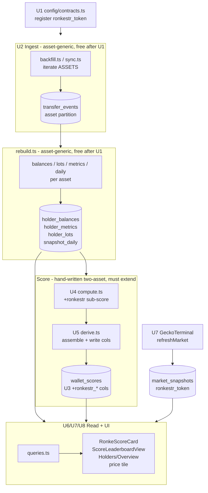

# feat: Add RonkeStr as a third asset and fold it into the Ronke Score

## Summary

Register **RonkeStr** (Ronke Strategy, an ERC-20 on Ronin at
`0x404533a09bf281199ce6b0ef60b7eff7123ff8dc`) as a third first-class asset in the
Ronkeverse analytics dashboard. Backfill its full transfer history through the
existing asset-generic ingest pipeline, add an **independent RonkeStr sub-score**
to the combined Ronke Score (symmetric to the current `$RONKE` token sub-score),
and surface RonkeStr everywhere the other two assets already appear: top holders,
concentration, time-series, leaderboards, wallet profiles, and a GeckoTerminal
price tile.

## Problem Frame

The dashboard today models exactly two assets - `$RONKE` (ERC-20) and Ronkeverse
(ERC-721) - and the Ronke Score is a two-way sum of a `$RONKE` sub-score and a
Ronkeverse sub-score. RonkeStr is a new, distinct Ronke-ecosystem token with its
own holders and its own diamond-hands behavior, but it is currently invisible:
holding it earns nothing and it appears on no chart. The founder wants RonkeStr to
count toward a wallet's Ronke Score and to be analyzable alongside the other two
assets.

The data pipeline was deliberately built asset-generic (every table partitions on
an `asset` key and the ingest/rebuild loops iterate `ASSETS`), so admitting a third
asset is mostly a registration + wiring exercise. The **scoring engine and a few
read paths are hardcoded two-asset**, so those are the parts that require real
change rather than config.

---

## Key Technical Decisions

- KTD-1. **RonkeStr scores as an independent third sub-score, not treasury
  look-through.** `combined score = $RONKE sub-score + RonkeStr sub-score +
  Ronkeverse sub-score`. The RonkeStr sub-score mirrors the existing `$RONKE`
  token math exactly - `holdWeight * log10(1 + balance)` for holding, gated
  exponential duration times the diamond-hands multiplier - so a long-term
  diamond mid-holder out-scores a passive whale, consistent with the score's
  stated design intent (`config/score.ts`). Chosen over MicroStrategy-style
  NAV/backing look-through, which would need treasury accounting and is out of
  scope. The config is structured so a look-through weighting could be layered
  later without re-migrating.

- KTD-2. **New asset key is `ronkestr_token`.** Follows the `<name>_token`
  convention (`ronke_token`, `ronkeverse_nft`). The DB `asset` column is `TEXT`
  (not a Postgres enum), so admitting a third value needs no column-type
  migration - only the closed TypeScript union in `config/contracts.ts` and the
  new `wallet_scores` sub-score columns change.

- KTD-3. **`wallet_scores` gains columns via `ALTER TABLE ... ADD COLUMN IF NOT
  EXISTS`, appended to `db/schema.sql`.** The table already exists on live Neon
  under `CREATE TABLE IF NOT EXISTS`, which will not add columns to an existing
  table. `db/migrate.ts` strips `--` comments, splits on `;`, and runs each
  statement, so idempotent `ALTER` statements are the correct in-band migration
  path. Sub-score columns added: `ronkestr_subscore`, `ronkestr_holding`,
  `ronkestr_duration`, `ronkestr_diamond_mult`.

- KTD-4. **Ingest source depends on RonkeStr's genesis block vs
  `MIGRATION_BLOCK` (55,577,490).** Blockscout only indexes post-L2 history;
  GoldRush (`lib/ronin/goldrush.ts`, legacy chain `axie-mainnet`) indexes Ronin's
  full pre-L2 history. If RonkeStr's first transfer is at or after
  `MIGRATION_BLOCK` (i.e. it launched on/after the 2026-05-12 L2 migration), the
  default Blockscout backfill path spans its entire history and no GoldRush
  stitch is needed. If it predates the migration, the backfill must use the
  GoldRush pre-L2 path like `$RONKE`. This is an execution-time check (U2), not a
  planning-time assumption. Do not trust the 2026-07-05 spike's "single Moralis
  pass" conclusion - the shipped `goldrush.ts` supersedes it.

- KTD-5. **RonkeStr's duration gate (`gate.minRonkestr`) is a tunable config
  value set relative to RonkeStr's circulating supply**, not a copy of
  `gate.minRonke = 100_000`. RonkeStr almost certainly has a different supply
  scale than `$RONKE`, so reusing the `$RONKE` threshold would mis-gate duration
  accrual. Ship a documented default and tune after seeing the real holder
  distribution (see Open Questions).

- KTD-6. **Market/price reuses the existing GeckoTerminal path, parameterized by
  asset.** `fetchRonkeMarket` already accepts an `address` option; the read
  (`getTokenMarket`) and the refresh (`refreshMarket`) hardcode
  `'ronke_token'`. Generalize both to fetch and upsert `(geckoterminal,
  ronkestr_token)`. Carry forward the honesty convention: label the price as a
  low-liquidity DEX quote with liquidity shown alongside.

---

## High-Level Technical Design

RonkeStr rides the existing append-only + rebuild architecture. The pure ingest
and snapshot layers already loop over `ASSETS`, so registering the asset (U1) makes
them process RonkeStr for free; the score engine, market refresh, and a few read
paths are the hand-written two-asset spots that must be extended.

Directional guidance for review, not an implementation spec. The load-bearing
insight: everything under `ingest` and `rebuild` is already generic; the work
concentrates in `score` and `read`.

---

## Output Structure

No new directories. All changes are edits to existing files plus new sibling test
files. Touch surface by area:

- **Config:** `config/contracts.ts`, `config/score.ts`
- **Schema:** `db/schema.sql`
- **Score engine:** `lib/score/compute.ts`, `lib/score/derive.ts`
- **Market:** `lib/market/geckoterminal.ts`, `lib/market/refresh.ts`
- **Reads:** `lib/queries.ts`, `lib/format.ts`
- **UI:** `app/components/RonkeScoreCard.tsx`,
  `app/components/ScoreLeaderboardView.tsx`, `app/components/AssetToggle.tsx`,
  wallet/overview surfaces

---

## Implementation Units

### U1. Register RonkeStr asset + asset-param plumbing

- **Goal:** Admit `ronkestr_token` into the closed `Asset` union and the URL asset
  param so every asset-generic pipeline stage and view can process and select it.
- **Requirements:** R1, R7
- **Dependencies:** none (foundation for all others)
- **Files:** `config/contracts.ts`, `lib/format.ts`,
  `app/components/AssetToggle.tsx`, `tests/config.test.ts`, `tests/format.test.ts`
- **Approach:**
  - `config/contracts.ts`: add `"ronkestr_token"` to the `Asset` union; add a
    `CONTRACTS.ronkestr_token` entry (`address:
    "0x404533a09bf281199ce6b0ef60b7eff7123ff8dc"` lowercased, `standard: "erc20"`,
    `label: "RonkeStr"`, `decimals: 18`). The union is `Record<Asset, ...>` so the
    compiler flags every exhaustive switch that now needs a third arm.
  - `lib/format.ts`: `assetFromParam` and `assetToParam` are binary
    (`"token" | "nft"`). Widen the param type to `"token" | "nft" | "ronkestr"`
    and map `"ronkestr"` <-> `ronkestr_token`.
  - `app/components/AssetToggle.tsx`: add a third toggle button ("RonkeStr").
    Generalize the hardcoded `["token", "nft"]` list and the label ternary to a
    small `{ value, label }` array driven off the asset param mapping.
  - R1 discipline: spot-confirm the address, standard, and decimals on
    `app.roninchain.com` before trusting for production; a correction is a
    one-line edit here.
- **Patterns to follow:** the existing `CONTRACTS` map and `assetForAddress`;
  keep the "addresses in config, secrets in env" split.
- **Test scenarios:**
  - `CONTRACTS.ronkestr_token` has the exact lowercased address, `erc20` standard,
    18 decimals; `assetForAddress` resolves the address (any case) to
    `ronkestr_token` and unknown addresses to `null`.
  - `ASSETS` contains all three keys in a stable order.
  - `assetFromParam("ronkestr")` -> `ronkestr_token`; `assetFromParam("ronkestr_token")`
    -> `ronkestr_token`; unknown/empty -> `ronke_token` (default preserved);
    round-trip `assetToParam(assetFromParam(x)) === x` for `token`/`nft`/`ronkestr`.
- **Verification:** typecheck passes (all exhaustive switches updated); the asset
  toggle renders three options and switching to RonkeStr updates `?asset=ronkestr`.

### U2. Backfill + incremental sync + continuity for RonkeStr

- **Goal:** Pull RonkeStr's full transfer history into `transfer_events` and keep
  it current on the daily sync, choosing the correct provider path for its genesis
  era.
- **Requirements:** R2, R3
- **Dependencies:** U1
- **Files:** `scripts/backfill.ts`, `scripts/sync.ts`, `lib/ronin/continuity.ts`,
  `tests/backfill.test.ts`, `tests/continuity.test.ts`, `tests/sync.test.ts`
- **Approach:**
  - `backfill.ts` and `sync.ts` already iterate `ASSETS`, so RonkeStr flows
    through both once U1 lands - no per-asset branching needed for the common path.
  - **Genesis-era check (KTD-4):** determine RonkeStr's first transfer block
    (e.g. Blockscout token transfers ascending, or GeckoTerminal pool creation).
    If `>= MIGRATION_BLOCK`, the default Blockscout backfill covers full history.
    If `< MIGRATION_BLOCK`, run the backfill with `source: "moralis"` /
    the GoldRush pre-L2 path used for `$RONKE`, and add a RonkeStr continuity
    fixture to `KNOWN_CONTINUITY` so `assertContinuity` gates the stitch.
  - Reuse the resumable ASC-cursor + `ON CONFLICT DO NOTHING` discipline; a
    mid-run interruption (e.g. Moralis CU exhaustion) re-runs safely.
- **Execution note:** Run the one-time `npm run backfill` locally off-Vercel
  (KTD-7); confirm the appended count and that the final rebuild ran before
  moving on.
- **Patterns to follow:** the `$RONKE` backfill path and `KNOWN_CONTINUITY`
  fixtures; `syncAsset`'s strictly-newer-than-cursor guard.
- **Test scenarios:**
  - `backfillAsset` for `ronkestr_token` appends every transfer once and advances
    the cursor to the max block; a second run over the same stream appends zero
    (idempotent).
  - `syncAsset` appends only events with `block_number > cursor` and no-ops when
    the tail is empty.
  - If a RonkeStr continuity fixture is added: `assertContinuity` passes when the
    known pre/post-migration transfers return and raises when the pre-migration one
    is missing.
  - `sync` still rebuilds even when RonkeStr appends zero events (staleness-footgun
    guard holds across three assets).
- **Verification:** after backfill, `transfer_events` has RonkeStr rows spanning
  its full history and `sync_cursor` has a `ronkestr_token` row; a subsequent
  `npm run sync` appends only new events.

### U3. Migrate `wallet_scores` for RonkeStr sub-score columns

- **Goal:** Add the four RonkeStr sub-score columns to `wallet_scores`
  idempotently on live Neon.
- **Requirements:** R4
- **Dependencies:** none (can land with or before U4/U5; must precede U5 writes)
- **Files:** `db/schema.sql`, `tests/schema.test.ts`
- **Approach:**
  - Append to `db/schema.sql`, after the `wallet_scores` `CREATE TABLE`:
    `ALTER TABLE wallet_scores ADD COLUMN IF NOT EXISTS ronkestr_subscore INTEGER NOT NULL DEFAULT 0;`
    and the same for `ronkestr_holding`, `ronkestr_duration` (INTEGER, default 0),
    and `ronkestr_diamond_mult` (DOUBLE PRECISION, default 0). Mirror the existing
    `ronke_*` column types exactly.
  - Keep each `ALTER` on one line with no embedded `;`/`--` so
    `splitStatements` treats it as a single statement.
  - Run `npm run migrate` against Neon.
- **Patterns to follow:** the idempotent-DDL convention already used throughout
  `schema.sql`; the `ronke_subscore` / `ronke_holding` / `ronke_diamond_mult`
  column shapes.
- **Test scenarios:**
  - `splitStatements` parses the new `ALTER TABLE ... ADD COLUMN IF NOT EXISTS`
    lines as individual statements (no `;` merge, no comment-boundary bug).
  - Running the migration twice is a no-op the second time (idempotent).
- **Verification:** `npm run migrate` succeeds; `wallet_scores` has the four new
  columns; re-running migrate applies cleanly.

### U4. RonkeStr sub-score in the score config + engine

- **Goal:** Extend the pure scoring engine so the combined score is a three-way
  sum including a RonkeStr sub-score that mirrors the `$RONKE` token math.
- **Requirements:** R4
- **Dependencies:** U1
- **Files:** `config/score.ts`, `lib/score/compute.ts`, `tests/score.test.ts`
- **Approach:**
  - `config/score.ts`: add a `ronkestr: { holdWeight }` block (start by mirroring
    `ronke.holdWeight = 150`, tune later) and `gate.minRonkestr` (KTD-5). Reuse
    the shared `duration` and `diamond` config - do not fork new curves.
  - `lib/score/compute.ts`: add `ronkestrBalanceWhole: number` and
    `ronkestrHold: AssetHold | null` to `ScoreInput`; add `ronkestrSubscore` plus
    `ronkestrHoldingPoints` / `ronkestrDurationPoints` / `ronkestrDiamondMult` to
    `ScoreResult.breakdown`. Add a RonkeStr sub-score block structurally identical
    to the `$RONKE` block (log holding, `minRonkestr`-gated exponential duration
    times diamond multiplier). Combined `score = ronkeSubscore + ronkestrSubscore
    + nftSubscore`.
- **Patterns to follow:** the existing `$RONKE` sub-score block in `computeScore`;
  keep `durationPoints` and `diamondMultiplier` shared and unchanged.
- **Test scenarios:**
  - A wallet holding only RonkeStr gets a positive `ronkestrSubscore` and zero
    `ronke`/`nft` sub-scores; combined equals the RonkeStr sub-score.
  - RonkeStr holding points follow `holdWeight * log10(1 + balance)` (diminishing):
    a 10x larger balance yields roughly `+holdWeight` more, not 10x more.
  - Duration points accrue only when balance `>= gate.minRonkestr`; below the gate,
    duration contributes zero even with a long hold.
  - Diamond multiplier applies to RonkeStr duration: `neverSold` (1.0) >
    `soldNotPaper` (0.6) > `everPaperSold` (0.3) for identical holds.
  - A wallet holding all three assets sums all three sub-scores; existing
    two-asset test vectors still pass with `ronkestrBalanceWhole: 0` /
    `ronkestrHold: null` defaults.
- **Verification:** `tests/score.test.ts` passes including new RonkeStr vectors;
  no change to existing `$RONKE`/NFT expectations.

### U5. Assemble + persist the RonkeStr sub-score

- **Goal:** Feed RonkeStr balances and holder metrics into the score derivation and
  write the new `wallet_scores` columns.
- **Requirements:** R4
- **Dependencies:** U2 (RonkeStr data present), U3 (columns exist), U4 (engine)
- **Files:** `lib/score/derive.ts`, `tests/score-derive.test.ts` (new)
- **Approach:**
  - In `assembleScoreInputs`, add a query for `holder_balances WHERE asset =
    'ronkestr_token' AND is_current_holder = true` to set `ronkestrBalanceWhole`
    (using RonkeStr decimals), and extend the `holder_metrics` loop so
    `asset = 'ronkestr_token'` populates `ronkestrHold` (today the loop is a binary
    `ronke_token` else NFT - make it an explicit three-way assignment).
  - Initialize the new `ScoreInput` fields in the `ensure()` default object.
  - In `deriveScores`, add the four RonkeStr breakdown values to the inserted row
    and to the `insertMany` column list.
- **Patterns to follow:** the existing `$RONKE` balance + metrics assembly in
  `assembleScoreInputs`; the `deriveScores` row/column construction.
- **Test scenarios:**
  - `assembleScoreInputs` over a fixture DB with RonkeStr balances + metrics
    produces `ScoreInput`s with correct `ronkestrBalanceWhole` (decimals applied)
    and `ronkestrHold` for RonkeStr holders, and nulls for non-holders.
  - The `holder_metrics` three-way split routes `ronkestr_token` rows to
    `ronkestrHold`, `ronke_token` to `ronkeHold`, and NFT rows to `nftHold` with no
    cross-contamination.
  - `deriveScores` writes the four RonkeStr columns; a RonkeStr-only wallet is
    persisted (non-zero combined score, not skipped by the `score <= 0` filter).
  - Integration: assemble -> compute -> persist for a wallet holding all three
    assets yields a `wallet_scores` row whose `score` equals the sum of the three
    sub-score columns.
- **Verification:** after a rebuild, `wallet_scores` RonkeStr columns are populated
  and `ronke_subscore + ronkestr_subscore + nft_subscore = score` for sampled rows.

### U6. Surface the RonkeStr sub-score in reads + score UI

- **Goal:** Expose the RonkeStr sub-score through the score queries and render it on
  the wallet profile score card and the score leaderboard.
- **Requirements:** R5
- **Dependencies:** U5
- **Files:** `lib/queries.ts`, `app/components/RonkeScoreCard.tsx`,
  `app/components/ScoreLeaderboardView.tsx`, `tests/leaderboard.test.tsx`,
  `tests/wallet.test.tsx`
- **Approach:**
  - `lib/queries.ts`: add `ronkestrSubscore` (and, for the profile, the
    `ronkestrHolding` / `ronkestrDuration` / `ronkestrDiamondMult` breakdown) to
    `WalletScore` and `ScoreLeaderboardRow`; select the new columns in
    `getWalletScore` and `getScoreLeaderboard`.
  - `RonkeScoreCard.tsx`: add a third sub-score card (RonkeStr) between `$RONKE`
    and Ronkeverse, showing Holding + Duration(diamond) rows like the `$RONKE`
    card. Adjust the grid so three cards lay out cleanly
    (`sm:grid-cols-2` -> a three-up responsive grid).
  - `ScoreLeaderboardView.tsx`: add a "RonkeStr Score" column between `$RONKE
    Score` and `Ronkeverse Score`.
- **Patterns to follow:** the existing `$RONKE` sub-score card and the leaderboard
  column rendering; `formatCompact` for score values.
- **Test scenarios:**
  - `getWalletScore` returns `ronkestrSubscore` + breakdown from a fixture row;
    `getScoreLeaderboard` includes `ronkestrSubscore` per row.
  - `RonkeScoreCard` renders three sub-score cards with correct RonkeStr holding /
    duration / multiplier values; a wallet with zero RonkeStr shows the card at 0
    (not hidden), consistent with the `$RONKE` card behavior.
  - `ScoreLeaderboardView` renders the RonkeStr column and the row total still
    reads as the combined score.
- **Verification:** the wallet profile shows a three-part score breakdown summing
  to the total; the leaderboard shows a RonkeStr column.

### U7. RonkeStr market/price integration

- **Goal:** Fetch and store a RonkeStr GeckoTerminal snapshot on the daily sync and
  render a RonkeStr price tile.
- **Requirements:** R6
- **Dependencies:** U1
- **Files:** `lib/market/geckoterminal.ts`, `lib/market/refresh.ts`,
  `lib/queries.ts`, market-tile UI (wallet/overview surface),
  `tests/market.test.ts`
- **Approach:**
  - `geckoterminal.ts`: `fetchRonkeMarket` already accepts `opts.address`. Either
    call it with the RonkeStr address or rename to a neutral `fetchTokenMarket`
    and keep a thin `$RONKE` caller; do not duplicate the parse logic.
  - `refresh.ts`: after the `$RONKE` snapshot step, add a RonkeStr fetch + upsert
    into `market_snapshots (geckoterminal, ronkestr_token)`. Keep it best-effort
    (a failure logs and never fails the sync), matching the `$RONKE` step.
  - `lib/queries.ts`: parameterize `getTokenMarket(asset: Asset = "ronke_token")`
    and add RonkeStr price to `getEcosystemStats` if RonkeStr belongs in the
    landing strip.
  - UI: render a RonkeStr price/volume/liquidity tile with the same low-liquidity
    honesty label as `$RONKE`.
- **Patterns to follow:** the `$RONKE` GeckoTerminal snapshot flow and the
  "DEX quote, low liquidity" labeling convention; KTD-7 (market calls only in the
  off-Vercel sync, served read-only).
- **Test scenarios:**
  - `parseTokenMarket` maps a RonkeStr GeckoTerminal payload to the typed shape;
    a non-OK response / shape change returns `null` (graceful degrade).
  - `refreshMarket` upserts a `(geckoterminal, ronkestr_token)` row and a RonkeStr
    fetch failure does not prevent the `$RONKE` snapshot or the sale-indexing step.
  - `getTokenMarket("ronkestr_token")` reads the RonkeStr snapshot; returns `null`
    when absent.
- **Verification:** after a sync, `market_snapshots` has a RonkeStr row and the UI
  shows a RonkeStr price tile (or a clean "unavailable" state if GeckoTerminal has
  no RonkeStr pool).

### U8. Full-parity read paths + remaining two-asset spots

- **Goal:** Extend the read paths and views that are still hardcoded two-asset so
  RonkeStr appears in holders, overview/concentration, time-series, per-asset
  leaderboards, and the wallet profile - the "full analytics parity" scope.
- **Requirements:** R7
- **Dependencies:** U1, U2 (data), U5 (scores, for the wallet profile)
- **Files:** `lib/queries.ts`, wallet/overview page + view components
  (`app/wallet/[address]/page.tsx`, `app/components/WalletView.tsx`,
  `app/components/OverviewView.tsx`, `app/overview/page.tsx` as applicable),
  `tests/overview.test.tsx`, `tests/holders.test.tsx`, `tests/wallet.test.tsx`
- **Approach:**
  - `getWallet` currently branches `ronke_token` vs else->NFT. Add an explicit
    `ronkestr_token` branch and a `ronkestrBalance` field on `WalletData`; render
    it on the profile.
  - `getEcosystemStats` maps `byAsset.get("ronke_token")` / `"ronkeverse_nft")`.
    Add `ronkestr_token` holder count where the ecosystem strip should show it.
  - `getOverview`, `getHolders`, `getLeaderboard` already take an `asset`
    argument, so they work for RonkeStr once pages pass the widened param
    (delivered by U1's `assetFromParam`). Verify each page reads the param and
    that RonkeStr renders in concentration, time-series, and histograms.
  - Audit for any remaining literal `"ronke_token" | "ronkeverse_nft"` assumptions
    surfaced by the compiler after U1 (exhaustive switches) and by grep.
- **Patterns to follow:** the `asset`-parameterized query functions already in
  `lib/queries.ts`; the AssetToggle-driven server-component pattern (U7 of the
  original build).
- **Test scenarios:**
  - `getWallet` returns a correct `ronkestrBalance` for a RonkeStr holder and `"0"`
    for a non-holder; the three-asset held-summary is correct.
  - `getOverview("ronkestr_token")` / `getHolders("ronkestr_token")` /
    `getLeaderboard("ronkestr_token", ...)` return RonkeStr rows from fixture data.
  - Overview/holders views render RonkeStr when `?asset=ronkestr` is selected.
  - `getEcosystemStats` includes the RonkeStr holder count.
- **Verification:** selecting RonkeStr in the toggle shows populated holders,
  concentration, and time-series; the wallet profile shows a RonkeStr balance.

---

## System-Wide Impact

- **Score inflation / leaderboard shift.** Adding an additive third sub-score
  raises the combined score of every RonkeStr holder and reshuffles the global
  Ronke Score leaderboard. This is intended (RonkeStr participation should count),
  but it is a visible, one-time ranking change on first rebuild after ship. There
  is no historical `wallet_scores` series to break; scores are rebuilt fresh each
  run.
- **Rebuild cost.** A third asset adds one more full `readEvents` +
  `computeAssetSnapshot` + persist pass per rebuild, plus its share of score
  assembly. RonkeStr's event count is likely far smaller than `$RONKE`/Ronkeverse,
  so the marginal cost is modest, but the daily sync wall-clock grows.
- **KTD-3 rebuild guarantee unchanged.** RonkeStr events flow through the same
  `rebuild()` that always runs as the final sync step; the staleness-footgun guard
  continues to hold across three assets.

---

## Requirements

**Data**
- R1. RonkeStr is registered as `ronkestr_token` (ERC-20, address
  `0x404533a09bf281199ce6b0ef60b7eff7123ff8dc`, 18 decimals) as a single source of
  truth in `config/contracts.ts`, spot-confirmed on Ronin before production.
- R2. RonkeStr's full transfer history is backfilled into `transfer_events` using
  the provider path correct for its genesis era (Blockscout post-L2, or GoldRush
  pre-L2 stitch).
- R3. The daily incremental sync keeps RonkeStr current and always triggers the
  rebuild, even on zero new events.

**Score**
- R4. A wallet's combined Ronke Score includes an independent RonkeStr sub-score
  (holding + gated exponential duration times diamond multiplier), persisted with
  its breakdown in new `wallet_scores` columns.
- R5. The wallet profile score card and the score leaderboard display the RonkeStr
  sub-score alongside `$RONKE` and Ronkeverse.

**Analytics parity**
- R6. A RonkeStr market snapshot (price/volume/liquidity) is fetched off-Vercel on
  the sync, stored per `(source, asset)`, and shown with a low-liquidity label.
- R7. RonkeStr is selectable across the asset-generic surfaces (holders,
  concentration, time-series, per-asset leaderboards) and appears on the wallet
  profile, at parity with the existing two assets.

---

## Risks & Dependencies

- **RonkeStr genesis block is unknown until checked (KTD-4).** If it predates
  `MIGRATION_BLOCK`, U2 must use the GoldRush pre-L2 path and add a continuity
  fixture; if not, Blockscout alone suffices. Resolve early in U2 - it determines
  the ingest approach.
- **GeckoTerminal may not index a RonkeStr pool.** If RonkeStr has no indexed
  Ronin DEX pool, the price tile degrades to "unavailable" (the fetch returns
  `null` gracefully). Price is best-effort and never blocks the score work.
- **Live-Neon migration is a real DDL change (KTD-3).** `ALTER TABLE ADD COLUMN IF
  NOT EXISTS` is safe and idempotent, but must be run against the production Neon
  DB (`npm run migrate`) before U5's derivation writes the new columns.
- **Gate calibration (KTD-5).** `gate.minRonkestr` set wrong (too high) silently
  zeroes RonkeStr duration points for real holders. Validate against the actual
  holder distribution after backfill.
- **Dependency on the shipped provider stack**, not the 2026-07-05 spike doc:
  `lib/ronin/goldrush.ts` is authoritative for pre-L2 history.

---

## Open Questions

- **`gate.minRonkestr` value (KTD-5):** what RonkeStr balance should gate duration
  accrual? Ship a documented default (proportional to RonkeStr circulating supply,
  or a round holder-percentile threshold) and tune after seeing the real
  distribution. Not a blocker - a config edit.
- **`ronkestr.holdWeight` calibration:** start at the `$RONKE` value (150) and
  confirm the RonkeStr sub-score sits at a sensible magnitude relative to the other
  two after the first rebuild; adjust in `config/score.ts` without re-migrating.
- **Ecosystem landing strip:** should RonkeStr price/holders join the ecosystem
  stats strip (`getEcosystemStats`), or stay confined to the asset-scoped views?
  Defaulting to include the holder count; confirm during U8.

---

## Sources / Research

- `config/contracts.ts` - `Asset` union, `CONTRACTS`, `ASSETS`, `MIGRATION_BLOCK`
  (55,577,490), `assetForAddress`, diamond thresholds.
- `db/schema.sql` - `asset`-partitioned tables (TEXT, no enum), `wallet_scores`
  column shape, `market_snapshots (source, asset)` PK.
- `db/migrate.ts` - idempotent statement splitter; why `ALTER ... ADD COLUMN IF
  NOT EXISTS` is the correct in-band migration.
- `lib/analytics/rebuild.ts` - asset-generic rebuild loop; derive order
  balances -> metrics -> concentration/timeseries -> badges -> `deriveScores`.
- `lib/score/compute.ts`, `lib/score/derive.ts`, `config/score.ts` - the
  hand-written two-asset scoring engine to extend.
- `lib/ronin/goldrush.ts` (per learnings research) - GoldRush is the pre-L2
  history source under legacy chain `axie-mainnet`; supersedes the 2026-07-05
  spike's "single Moralis pass" conclusion.
- `lib/market/geckoterminal.ts`, `lib/market/refresh.ts`, `lib/queries.ts`
  (`getTokenMarket`) - the `$RONKE`-hardcoded market path to parameterize.
- `lib/format.ts` (`assetFromParam`/`assetToParam`), `app/components/AssetToggle.tsx`
  - binary asset-param plumbing to widen to three.
- No `docs/solutions/` corpus exists yet; the "how we add a new asset" runbook
  (score-engine + provider-drift gotchas) is a good `ce-compound` candidate once
  this ships.
</content>
</invoke>
